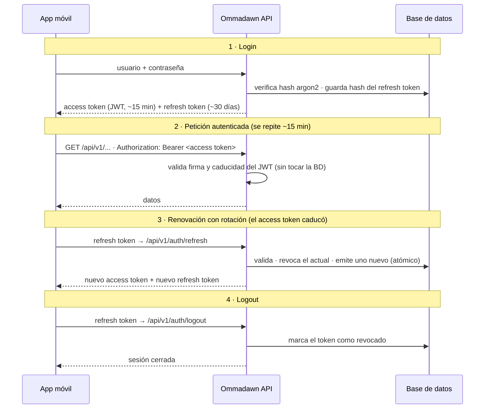

# Ommadawn API

API REST que cataloga la obra de **Mike Oldfield**: discografía (álbumes de
estudio, recopilatorios, singles, directos, bootlegs…), conciertos, libros y
otras secciones. Está pensada para ser consumida por una **app móvil** (primero
iOS y, en el futuro, Android), por lo que el contrato de la API (REST + OpenAPI)
es un ciudadano de primera clase: estable y bien versionado.

> Proyecto de aprendizaje, pero construido con criterio y con la intención de
> publicarse y ser usado de verdad. Se avanza en **fases pequeñas y entendibles**
> (ver más abajo), priorizando el *por qué* de cada decisión sobre la velocidad.

---

## Stack

| Tecnología | Función |
|---|---|
| Python 3.12+ | Lenguaje |
| FastAPI | Framework web async; genera OpenAPI automáticamente |
| SQLAlchemy 2.0 (async) | ORM |
| Alembic | Migraciones de base de datos |
| Pydantic v2 + pydantic-settings | Schemas de API y configuración vía `.env` |
| argon2-cffi | Hashing de contraseñas (argon2id) |
| PyJWT | Access / refresh tokens |
| PostgreSQL (asyncpg) | Base de datos en **desarrollo** (Docker) y **producción** |
| SQLite (aiosqlite) | Alternativa rápida en local sin Docker |
| pytest + pytest-asyncio + httpx | Tests de integración |

Pasar de desarrollo a producción es **solo cambiar `DATABASE_URL`** en `.env`,
sin tocar código.

---

## Arquitectura

**Monolito modular** (no microservicios): una única aplicación FastAPI dividida
en **módulos por dominio** (`auth`, `discography`, `concerts`…). La adaptabilidad
se consigue con **fronteras limpias entre módulos**, no separando en procesos:

- Cada módulo es autocontenido: tiene sus propios `models`, `schemas`,
  `service` y `router`.
- Los módulos **no** acceden a las tablas de otro módulo directamente: se
  comunican a través de la capa de `service`. Esto permite, el día que haga
  falta, extraer un módulo a un servicio independiente con poca fricción.
- Lo compartido (config, engine de BD, `Base` ORM, seguridad) vive en `core/`.

**Arquitectura en capas** dentro de cada módulo — `router → service → model`,
con `schema` como contrato de entrada/salida:

- **router**: define endpoints y dependencias (auth, sesión de BD). Sin lógica
  de negocio.
- **service**: toda la lógica de negocio y el acceso a datos. No sabe nada de HTTP.
- **model**: tablas SQLAlchemy.
- **schema**: modelos Pydantic para request/response. Los models ORM nunca se
  exponen directamente en la API.

**Versionado desde el día 1**: todos los endpoints cuelgan de `/api/v1/...`. Un
cambio incompatible implica una nueva versión (`/api/v2`), no romper la existente.

---

## Estructura del proyecto

```
ommadawn-api/
├── app/
│   ├── main.py                 # App FastAPI, lifespan, montaje de routers
│   ├── core/
│   │   ├── config.py           # Settings vía pydantic-settings (.env)
│   │   ├── database.py         # Engine async, sesión, Base ORM, get_session
│   │   ├── security.py         # argon2 (hashing) + JWT + refresh tokens
│   │   ├── exceptions.py       # HTTPExceptions reutilizables
│   │   ├── openapi.py          # Post-proceso del openapi.json (opcionales aptos para iOS)
│   │   └── storage.py          # StorageBackend: Local (dev) ahora, GCS pendiente
│   └── modules/
│       ├── auth/
│       │   ├── models.py       # User, RefreshToken
│       │   ├── schemas.py      # Contratos Pydantic (request/response)
│       │   ├── service.py      # Lógica: registro, login, tokens, rotación
│       │   ├── dependencies.py # get_current_user, require_admin (protegen endpoints)
│       │   └── router.py       # Endpoints /api/v1/auth/*
│       └── discography/
│           ├── models.py       # Release -> Edition (is_primary) -> Track / Image
│           ├── schemas.py      # Release/Edition/Track/Image: Create, Read, Update
│           ├── service.py      # CRUD anidado + demotes + subida de imágenes
│           └── router.py       # Endpoints /api/v1/discography/*
├── migrations/                 # Alembic: env.py (async) + versions/
│   ├── env.py                  # Lee la URL de Settings, expone Base.metadata
│   └── versions/               # Una migración por cambio de esquema
├── tests/
│   ├── conftest.py             # Fixtures (cliente HTTP + BD en memoria)
│   ├── test_auth.py            # Tests de integración de auth
│   └── test_discography.py     # Tests de integración de discografía
├── docker-compose.yml          # PostgreSQL local para desarrollo
├── alembic.ini                 # Config de Alembic
├── .env.example
└── pyproject.toml
```

---

## Puesta en marcha

```bash
# Entorno e instalación
python3 -m venv .venv
source .venv/bin/activate
pip install -e ".[dev]"

# Configuración
cp .env.example .env
python3 -c "import secrets; print(secrets.token_urlsafe(64))"   # generar SECRET_KEY
# …y pégala en la variable SECRET_KEY de tu .env

# Base de datos: levantar el PostgreSQL local (Docker)
docker compose up -d          # Postgres en localhost:5432
alembic upgrade head          # crea/actualiza el esquema

# Arrancar el servidor
uvicorn app.main:app --reload
```

> **Base de datos en desarrollo.** Se usa un PostgreSQL local vía Docker
> (`docker compose up -d`), igual motor que en producción, para probar
> migraciones y comportamiento real. La `DATABASE_URL` del `.env` ya apunta a él;
> si prefieres no usar Docker, hay una línea comentada con SQLite.

Con el servidor en marcha, FastAPI genera la documentación de la API sola:

| URL | Qué es |
|---|---|
| http://localhost:8000/docs | **Swagger UI** — documentación interactiva (probar endpoints, botón *Authorize*) |
| http://localhost:8000/redoc | **ReDoc** — documentación de lectura/referencia |
| http://localhost:8000/openapi.json | **Contrato OpenAPI** — fuente para generar clientes (p. ej. el de iOS con `swift-openapi-generator`) |

El esquema de la base de datos lo gestiona **siempre Alembic**, igual en
desarrollo que en producción: tras cambiar un modelo se genera una migración
(`alembic revision --autogenerate -m "..."`) y se aplica (`alembic upgrade
head`). La app no crea tablas "mágicamente" al arrancar, para que dev y prod no
diverjan.

### Tests

```bash
pytest tests/ -v
pytest tests/test_auth.py::test_login -v        # un solo test
```

---

## Sistema de autenticación (tokens)

Se manejan **dos tokens con roles distintos**:

| | Access token | Refresh token |
|---|---|---|
| Qué es | Un **JWT** firmado | Una cadena aleatoria **opaca** |
| Dónde vive la verdad | En el propio token (*stateless*) | En la **base de datos** (hasheado) |
| Duración | Corta (~15 min) | Larga (~30 días) |
| ¿Se puede revocar? | No (hasta que caduque) | Sí |
| Se usa para… | Autenticar cada petición | Renovar el access token |

- Las **contraseñas** se hashean con **argon2** (nunca se guardan en claro).
- Los **refresh tokens** se guardan **hasheados** (SHA-256): quien lea la BD no
  puede reutilizarlos.
- **Rotación**: cada renovación revoca el refresh token usado y emite uno nuevo,
  de forma atómica. Un token robado deja de servir en cuanto el usuario legítimo
  renueva.
- **Detección de reúso**: si un refresh token **ya rotado** reaparece (señal de
  que hay dos copias circulando → robo), se revoca **toda la sesión** del usuario
  y se le obliga a volver a iniciar sesión con contraseña.
- **`expires_in`**: `login` y `refresh` devuelven la vida del access token en
  segundos (p. ej. `900`), para que el cliente pueda renovar de forma **proactiva**
  antes de que caduque, en vez de esperar a un `401`.

### Endpoints

| Método | Ruta | Protegido | Descripción |
|---|---|---|---|
| `POST` | `/api/v1/auth/register` | — | Crea un usuario (devuelve el perfil, `201`) |
| `POST` | `/api/v1/auth/login` | — | Login por username **o** email; devuelve el par de tokens |
| `POST` | `/api/v1/auth/refresh` | — | Rota el refresh token y emite un par nuevo |
| `POST` | `/api/v1/auth/logout` | 🔒 | Revoca el refresh token (`204`) |
| `GET` | `/api/v1/auth/me` | 🔒 | Devuelve el usuario autenticado |
| `PATCH` | `/api/v1/auth/me` | 🔒 | Edita `full_name`, `country` (ISO 3166-1 alpha-2), `city`, `birth_date`, `theme_preference` (solo los campos enviados) |
| `POST` | `/api/v1/auth/me/avatar` | 🔒 | Sube (o sustituye) el avatar (`multipart/form-data`) |
| `DELETE` | `/api/v1/auth/me/avatar` | 🔒 | Borra el avatar (idempotente) |
| `GET` | `/api/v1/auth/users` | 🔒👑 | Lista todos los usuarios |
| `PATCH` | `/api/v1/auth/users/{id}` | 🔒👑 | Cambia si otro usuario es `admin` |

🔒 = requiere `Authorization: Bearer <access token>`. 🔒👑 = requiere además ser
**superadministrador** (`is_super_admin=True`; como con `is_admin`, se marca directamente en
BD — no hay endpoint para auto-nombrarse superadmin).

> **Pendiente**: editar `username`/`email`/contraseña sigue sin endpoint (requieren
> comprobaciones propias de unicidad/verificación no abordadas todavía).

### Flujo: del login al logout



---

## Discografía

Discos, recopilatorios, singles, bootlegs y directos se catalogan en cuatro niveles:

```
Release     (la obra abstracta: "Tubular Bells", tipo: studio/compilation/single/bootleg/live)
  └── Edition   (publicación concreta: país, Label, nº catálogo, fecha, formato, créditos, notas)
        ├── Track     (aparición de una grabación en ESA edición: posición, disco, cara)
        │     └── Recording  (la grabación real: título, duración, créditos — COMPARTIDA)
        └── Image     (portada, contraportada... con posición reordenable)
```

`Recording` es la pieza clave: cuando la misma grabación aparece en varias ediciones (por
ejemplo "Tubular Bells Part One" en la edición original y en el recopilatorio *Boxed*), se
referencia el mismo `recording_id` desde ambos `Track` — los créditos se escriben una sola vez.

`Release` tiene un campo `description` (texto libre, sin límite de longitud) para la
historia e información de la obra — contexto de grabación, curiosidades, relevancia…
Es opcional y pertenece a la obra abstracta, no a una edición concreta.

`format` indica el soporte físico de la edición: `vinyl`, `cd`, `single`, `maxi_single`,
`cd_single` o `cassette` (opcional). `credits` y `notes` son texto libre sin límite de
longitud (músicos/producción y notas generales, respectivamente); todos los campos de
`Edition` son opcionales. El campo `country` acepta códigos **ISO 3166-1 alpha-2**
(`"GB"`, `"JP"`, `"US"`…) — la API normaliza a mayúsculas y devuelve 422 si el código
no existe.

Un mismo disco puede tener varias ediciones (la original, una reedición remasterizada,
una edición de otro país con otra portada y hasta otra *tracklist*). `is_primary` marca
cuál se muestra por defecto; solo puede haber una principal por obra.

Leer el catálogo es **público**; crear, editar o borrar exige ser **administrador**.

### Endpoints

| Método | Ruta | Protegido | Descripción |
|---|---|---|---|
| `GET` | `/api/v1/discography/labels` | — | Lista sellos discográficos (filtro `?q=` por nombre) |
| `POST` | `/api/v1/discography/labels` | 🔒👑 | Crea un sello (nombre único sin distinguir mayúsculas) |
| `PATCH` / `DELETE` | `/api/v1/discography/labels/{id}` | 🔒👑 | Edita o borra un sello (409 en DELETE si alguna edición lo usa) |
| `GET` | `/api/v1/discography/recordings` | — | Busca grabaciones por título (`?q=tubular`); cada resultado incluye `usages` con las ediciones donde aparece |
| `PATCH` | `/api/v1/discography/recordings/{id}` | 🔒👑 | Edita título, duración y/o créditos de una grabación |
| `DELETE` | `/api/v1/discography/recordings/{id}` | 🔒👑 | Borra una grabación (409 si sigue referenciada por algún track) |
| `GET` | `/api/v1/discography/releases` | — | Lista obras (filtro opcional `?type=studio\|compilation\|single\|bootleg\|live`) |
| `GET` | `/api/v1/discography/releases/{id}` | — | Detalle de una obra, con sus ediciones y temas |
| `POST` | `/api/v1/discography/releases` | 🔒👑 | Crea una obra (título + tipo, sin ediciones aún) |
| `PATCH` / `DELETE` | `/api/v1/discography/releases/{id}` | 🔒👑 | Edita o borra una obra |
| `POST` | `/api/v1/discography/releases/{id}/editions` | 🔒👑 | Añade una edición (con su tracklist) a una obra |
| `PATCH` / `DELETE` | `/api/v1/discography/releases/{id}/editions/{edition_id}` | 🔒👑 | Edita o borra una edición |
| `POST` | `.../editions/{edition_id}/images` | 🔒👑 | Sube una imagen (`multipart/form-data`: `image_type` + `file`) |
| `PATCH` | `.../editions/{edition_id}/images/{image_id}/position` | 🔒👑 | Mueve la imagen arriba o abajo (`{"direction": "up"\|"down"}`); devuelve la lista completa reordenada |
| `DELETE` | `.../editions/{edition_id}/images/{image_id}` | 🔒👑 | Borra una imagen |

🔒👑 = requiere `Authorization: Bearer <access token>` de un usuario **administrador**
(`is_admin=True`; se marca directamente en BD, no hay endpoint público para ello).

**Tracks**: cada `Track` referencia una `Recording` (por `recording_id`). Al crear/editar una
edición, cada tema del array `tracks` acepta dos formas:
- **Grabación nueva**: `title` (+ `duration_seconds`, `credits` opcionales), `position`, `disc_number` (default 1), `side` (nullable, solo vinilos: `"A"`, `"B"`…).
- **Grabación existente**: `recording_id` + `position` + `disc_number` + `side`. Los campos `title`/`credits` se ignoran: vienen de la `Recording` original.

`disc_number` y `side` permiten agrupar por CD o cara: el cliente construye la cabecera
("CD 1", "Cara A") a partir de esos valores. `TrackRead` expone `recording_id` para que
la app pueda reutilizarlo en otras ediciones; `GET /recordings?q=...` ayuda a encontrarlo.

**Imágenes**: solo se guarda la `url` en la base de datos, nunca los bytes. En desarrollo
se sirven desde disco local (`/media`, fuera de `/api/v1`); en producción será un bucket de
Google Cloud Storage (pendiente), elegido por `STORAGE_BACKEND` en `.env` sin tocar código.
Subir una `front_cover`/`back_cover` nueva **sustituye** la anterior; `other` se acumula.
Cada imagen tiene un campo `position` (asignado automáticamente como max+1 al subir) que
determina el orden de visualización dentro de la edición; se puede reordenar con flechas
arriba/abajo usando el endpoint de posición.

---

## Entorno de preproducción

La preproducción corre en una **Raspberry Pi** (Ubuntu 24.04) expuesta en internet:

| | |
|---|---|
| **Dominio** | `https://api.pre.ommadawn.es` |
| **Docs** | `https://api.pre.ommadawn.es/docs` · `/redoc` |
| **Stack en Pi** | Gunicorn + UvicornWorker · PostgreSQL nativo · Caddy (TLS automático vía Let's Encrypt) |

Todos los servicios corren como unidades systemd (`ommadawn-api`, `caddy`). El certificado TLS lo gestiona Caddy solo — se renueva automáticamente.

### Desplegar cambios

```bash
./deploy/pre.sh
```

Hace en orden: `git pull` → instala dependencias nuevas → `alembic upgrade head` → reinicia el servicio.

### Control del servicio desde el móvil

Un bot de Telegram corre en la Pi (`ommadawn-bot` systemd). Solo responde al chat autorizado:

| Comando | Acción |
|---|---|
| `/status` | Estado del servicio |
| `/on` | Iniciar |
| `/off` | Detener |
| `/restart` | Reiniciar |

---

## Plan por fases

El proyecto se construye por fases pequeñas; cada una se cierra (y se entiende)
antes de empezar la siguiente.

| Fase | Contenido | Estado |
|---|---|---|
| **1 — Esqueleto** | Estructura del proyecto, capa `core/` (config, base de datos, `Base` ORM) y app FastAPI con `/health`. | ✅ Hecha |
| **2 — Modelo de usuario** | Model ORM `User`: login por username o email (únicos), `full_name` y `hashed_password` opcionales (preparado para OAuth), `is_active`, `is_admin`, timestamps. Ampliado con datos de perfil editables (`country`, `city`, `birth_date`, avatar, `theme_preference`) y rol `is_super_admin`. | ✅ Hecha |
| **3 — Flujo de tokens** | Hashing argon2, JWT access token y refresh token con rotación. | ✅ Hecha |
| **4 — Endpoints de auth** | `register`, `login`, `refresh`, `logout`, `me` + tests de integración. Cierra el bloque de auth. | ✅ Hecha |
| **5 — Discografía** | Álbumes de estudio, recopilatorios, singles, bootlegs, directos… y sus temas/pistas. | 🚧 En marcha (discos ya funcionando) |
| **6 — Conciertos** | Giras, fechas, salas, setlists. | Pendiente |
| **7 — Libros** | Bibliografía relacionada. | Pendiente |
